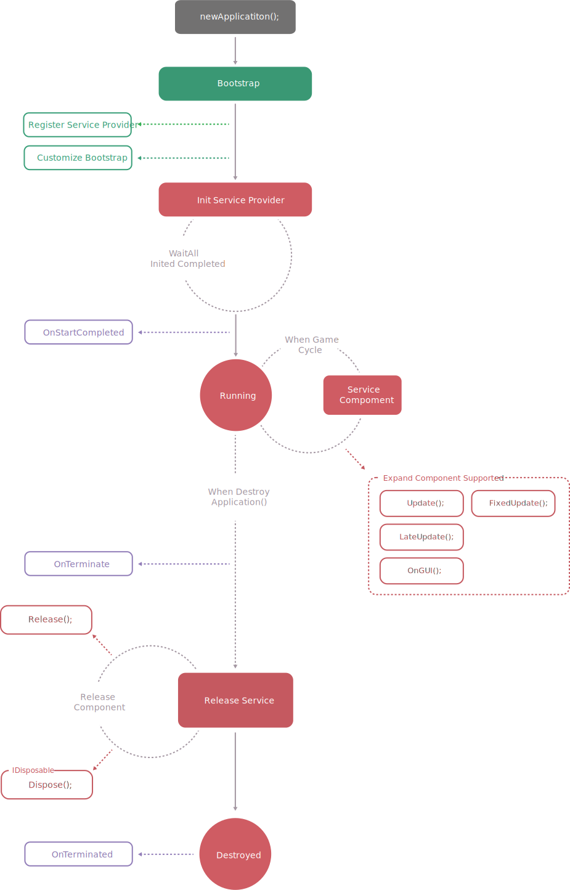

# 应用程序

`Application`是CatLib程序的核心，也是所谓的程序入口。应用程序通过引导来加载服务提供者和其他一些必须的资源。应用程序在一般情况下只允许启动一个，且只能在主线程中启动。

在任何位置，您可以通过`App`全局变量访问应用程序。

## 启动流程

`App.Bootstrap` -> `App.Register` -> `App.Init`

- `App.Bootstrap` 一般用于引导注册服务提供者，初始配置或者一些其他资源。
- `App.Register` 用于注册服务提供者到框架。
- `App.Init` 激活所有服务提供者的`Init函数`，并完成框架初始化。

##### 建议的调用结构：

```markdown
- App.Bootstrap
- - App.Register
- - #... more
- App.Init
```

> 我们一般建议在Bootstrap中调用Register注册函数。

## 生命周期

<div style="padding-left:10%"></div>

## 创建框架实例

- 通过`Application.New`来创建框架实例
```csharp
Application.New();
```

- 通过手动实例化创建框架实例
```csharp
var application = new Application();
```

## 引导程序

引导程序必须继承自`CatLib.IBootstrap`接口。引导程序可以被用来引导注册服务提供者，或者其他需要在框架启动之前加载的程序。

```csharp
public class DebugBootstrap : IBootstrap
{
    public void Bootstrap()
    {
        Console.WriteLine("hello debug");
    }
}
```

```csharp
App.Bootstrap(new DebugBootstrap()); // 输出: hello debug
```

## 注册服务提供者

通过`App.Register`函数可以将服务提供者注册到应用程序中。服务提供者必须实现`CatLib.IServiceProvider`接口。

``` csharp
public class DebugProvider : IServiceProvider
{
    public void Init(){ }
    public void Register()
    {
        Console.WriteLine("hello register");
    }
}
```

```csharp
App.Register(new DebugProvider()); // 输出：hello register
```

## 初始化框架

调用`App.Init`函数将会初始化框架，并且`激活`所有已经注册到应用程序中的服务提供者的`Init`函数。

``` csharp
public class FileSystemProvider : IServiceProvider
{
    public void Init()
    { 
        Console.WriteLine("hello init [FileSystemProvider]");
    }
    public void Register()
    {
        Console.WriteLine("hello register [FileSystemProvider]");
    }
}
```

``` csharp
public class DebugProvider : IServiceProvider
{
    public void Init()
    { 
        Console.WriteLine("hello init [DebugProvider]");
    }
    public void Register()
    {
        Console.WriteLine("hello register [DebugProvider]");
    }
}
```

```csharp
App.Register(new DebugProvider());      // 输出：hello register [DebugProvider]
App.Register(new FileSystemProvider()); // 输出：hello register [FileSystemProvider]

App.Init();                             // 输出：hello init [DebugProvider]
                                        // 输出：hello init [FileSystemProvider]
```

## 终止应用程序

当程序退出时，您需要调用`App.Terminate`方法来终止框架运行，这样框架中注册的服务都会被有序释放,释放顺序请参考[生命周期图](#生命周期)。

```csharp
App.Terminate();
```

## 全局事件系统

应用程序已经内嵌的事件系统，详细文档请参考[事件系统](../components/event.html)，下面是可以被使用的事件函数：

```csharp
App.HasListeners();
App.Trigger();
App.TriggerHalt();
App.On();
App.Listen();
App.Off();
```

## 框架事件

下面的事件已经内嵌到应用程序内，满足条件时会自动触发，事件名都被放在`ApplicationEvents`中。

```csharp
App.On(ApplicationEvents.OnStartCompleted, ()=>{
    // todo:
});
```

| 事件名                            | 描述                 |
| -------------------------------- |:----------------------------:|
| `OnBootstrap`            | 在框架引导开始之前。      |
| `Bootstrapping`          | 在框架引导进行中，每次引导被激活前都会调用，会提供参数`IBootstrap`，参数值为当前准备被激活的引导。返回一个不为`null`的值(一般为`false`)可以终止引导激活。      |
| `OnBootstraped`          | 在框架引导完成之后。      |
| `OnRegisterProvider`     | 在注册服务提供者时，每次注册服务提供者都会触发，会提供参数`IServiceProvider`，参数值为当前准备被注册的服务提供者。返回一个不为`null`的值(一般为`false`)可以终止服务提供者注册。      |
| `OnInit`                 | 在框架初始化之前。      |
| ~~`OnIniting`~~          | ~~在框架初始化进行中，每个服务提供者初始化之前都会触发，会提供参数`IServiceProvider`，参数值为当前准备被初始化的服务提供者。~~      |
| `OnProviderInit`         | 在服务提供者初始化启动之前。会提供参数`IServiceProvider`，参数值为当前准备被初始化的服务提供者。      |
| `OnProviderInited`       | 在服务提供者初始化启动之后。会提供参数`IServiceProvider`，参数值为当前准备被初始化的服务提供者。      |
| `OnInited`               | 在框架初始化完成后。      |
| `OnStartCompleted`       | 在框架进入运行状态后触发。开发者可以接受这个事件来进入自己的业务代码。      |
| `OnTerminate`            | 在框架终止之前。      |
| `OnTerminated`           | 在框架终止之后。      |

# 当框架被新创建时

通过`App.OnNewApplication`您可以捕获Application的创建事件，这对于一些在Application被创建前就已经执行的程序或者需要监听应用程序变化的程序非常有用。

``` csharp
App.OnNewApplication += (app)=>{
    // todo:
};
```

> `App.OnNewApplication`在`new Application`之前可以被使用

## 设定框架的调试等级

您可以通过`App.DebugLevel`来设定框架的调试等级，所有的组件都可以识别这个调试等级来做出对应的处理。

```csharp
App.DebugLevel = DebugLevels.Production; // Production，Staging，Development
```

> 调试等级的默认值为:`DebugLevels.Production`

## 获取运行期间的唯一Id

在应用程序生命周期内，您可以使用`App.GetRuntimeId`函数来获取运行时的唯一Id，该函数多线程安全。

```csharp
int uuid = App.GetRuntimeId();
```

## 判断服务是否被注册

通过`App.IsRegisted`可以判断服务提供者是否已经被注册到应用程序中了。

```csharp
App.IsRegisted(new FileSystemProvider()); // return false
```

## 是否在主线程中执行

您可以通过`App.IsMainThread`来判断是否处于主线程中，该函数多线程安全。

``` csharp
App.IsMainThread;
```

> 创建应用程序的线程会被认为是主线程

## 获取当前框架的版本

通过`App.Version`可以获取当前框架的版本，框架版本遵循[语义化版本](../upgrade.html)

```csharp
string version = App.Version;
```

## 比较框架版本

某些场景需要比较当前运行时的框架版本，这时您可以通过`App.Compare`函数来比较版本。

```csharp
// App.Version 2.0.0
App.Compare("1.2.3"); // return 1
App.Compare("2.2.3"); // return -1
```

## 完整的例子

- 设计服务接口`FileSystem/IFileSystem.cs`:
```csharp
public interface IFileSystem
{
    void HelloWorld();
}
```

- 开发服务实现`FileSystem/FileSystem.cs`:
```csharp
public class FileSystem : IFileSystem
{
    public void HelloWorld()
    {
        Console.WriteLine("hello world");
    }
}
```

- 创建服务提供者`FileSystem/FileSystemProvider.cs`:
``` csharp
public class FileSystemProvider : IServiceProvider
{
    public void Init(){ }
    public void Register()
    {
        App.Singleton<FileSystem>().Alias<IFileSystem>();
    }
}
```

- 创建服务提供者引导列表`Config/Providers.cs`:
```csharp
public static class Providers
{
    /// <summary>
    /// 服务提供者
    /// </summary>
    public static IServiceProvider[] ServiceProviders
    {
        get
        {
            return new IServiceProvider[]{
                new FileSystemProvider()
            };
        }
    }
}
```

- 创建引导程序`Bootstrap/ProvidersBootstrap.cs`:
```csharp
public class ProvidersBootstrap : IBootstrap
{
    public void Bootstrap()
    {
        foreach (var provider in Providers.ServiceProviders)
        {
            if (!App.IsRegisted(provider))
            {
                App.Register(provider);
            }
        }
    }
}
```

- 创建框架入口文件，`Main.cs`:
```csharp
Application.New();
App.Bootstrap(new ProvidersBootstrap());
App.Init();
```

- 使用服务`Main.cs`:
```csharp
App.Make<IFileSystem>().HelloWorld(); // 输出:hello world
```