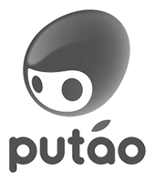
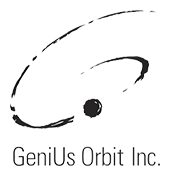

# 介绍

<a href="https://github.com/catlib/core/blob/master/LICENSE"></a> <a href="https://ci.appveyor.com/project/catlib/core"></a> 

## CatLib是什么

CatLib 是一套`渐进式`的`服务提供者框架`。框架为客户端提供多个实现，并把他们从多个实现中解耦出来。服务提供者的改变对它们的客户端是透明的，这样提供了更好的可扩展性。她不仅易于上手，还便于与第三方库或既有项目整合。

- `CatLib Core` 是最小可用框架。仅提供最基础的功能，是其他框架开发者作为基础的理想选择。
- `CatLib Framework` 以最小可用框架作为基础，提供了常见的基础组件来减少开发者们不必要的工作。
- `CatLib For Unity` 在Framework的基础上增加了对Unity的专有组件支持（要求Unity 2017+）。

## CatLib的优势

- CatLib是渐进式的框架，可以无缝和现有框架融合。无论您的项目处于哪个阶段您都可以轻易的接入CatLib。
- CatLib提供的依赖注入方案，可以极大程度的帮助项目解耦。
- CatLib提供了大量可靠，可持续的公共组件，帮助企业降低开发成本。
- 基于MIT协议，企业可以通过CatLib的组件化方案建立私有的公共组件库，提高项目研发效率和质量。
- 轻量级的框架，所有的组件都是可以被移除的，您可以只选择适合您的组件。
- 中文文档完善，极低的学习成本。
- 面向接口编程，底层组件无感知替换。

## 学习路线图

CatLib是易于上手的。你只需要有良好的 C# 基础。你就可以非常快速地通过阅读这份 指南 投入开发。

- [服务提供者](architecture/service-provider.html): 了解服务提供者的基本概念，以及系统架构。
- [核心框架](architecture/framework.html): 了解核心框架的运行生命周期，以及具备的功能。
- [服务容器](architecture/container.html): 了解核心容器的运行原理以及可用方法。
- [服务接口](architecture/api.html): 了解服务接口概念，对比门面的区别。
- [服务门面](architecture/facade.html): 了解服务门面概念，对比常规静态方法。
- [风格指南](style.html): 帮助开发者避免错误，降低沟通成本，解决小纠结和[反模式](anti-pattern.html)。

## 安装

##### 使用Nuget安装

```PM
Install-Package CatLib.Core -Version 1.4.0
```

##### 通过Unity Package Manager安装

- 第一次使用时，打开文件`[项目路径]/Packages/manifest.json`,并增加：

```json
"scopedRegistries": [
  {
    "name": "taobao",
    "url": "https://registry.npm.taobao.org",
    "scopes": [
      "com.catlib"
    ]
  }
]
```

- 然后通过 `unity package manager` 安装 `CatLib.Unity` 组件包

##### 直接下载发布版本

下载[最新版本](https://github.com/CatLib/Core/releases)。

## 使用者

<a href="http://www.ztgame.com/"></a> <a href="http://www.ourpalm.com/"></a> <a href="http://www.06game.com/"></a> <a href="http://www.putao.com/"></a> <a href="http://www.app-echo.com/"></a> <a href="http://www.hrgame.com.cn/"></a> <a href="http://www.heeking.com"></a> <a href="http://www.sourcemuch.com"></a>

<a href="http://www.fancydream.net"></a> <a href="https://www.koalac.com/"></a> <a href="http://www.geniusorbit.com/"></a> <a href="http://geescan.com"></a>

## 如何选择

在采集使用CatLib的公司和个人中：

- 绝大多数`中大型企业`或`框架开发者`都采用了 [CatLib Core](https://github.com/CatLib/Core)。
- 绝大多数`小型企业`都采用了 [CatLib Framework](https://github.com/CatLib/Framework)。
- `个人开发者`多数从 [CatLib Unity](https://github.com/CatLib/CatLib) 开始入门。

## 技术支持

- QQ群: [150371044](//shang.qq.com/wpa/qunwpa?idkey=ac3de81fa9b3a4379f80c44e05ff021bcfb51c0fb9092b0741762265a911878b) (验证: CatLib Support)
- email: support@catlib.io
- slack: catlib.slack

> QQ群禁止水聊，但对技术类提问范围不限制，如：遇到友情链接中的项目的问题也可以直接在群中`@相关作者`。

## 友情链接

#### UI框架

- [FairyGUI](http://www.fairygui.com/) 编辑器操作简单，使用习惯与Adobe系列软件保持一致，策划和美术设计师可以轻松上手。在编辑器即可组合各种复杂UI组件，以及为UI设计动画效果，无需编写任何代码。可一键导出到Unity，Starling，Egret， LayaAir，Flash等多个主流应用和游戏平台。（`@谷主`）

#### 热更新方案

- [ILRuntime](https://github.com/Ourpalm/ILRuntime) 项目为基于C#的平台（例如Unity）提供了一个纯C#实现的，快速、方便并且可靠的IL运行时，使得能够在不支持JIT的硬件环境（如iOS）能够实现代码的热更新（`@蓝色幻想`）
- [XLua](https://github.com/Tencent/xLua) 为Unity、 .Net、 Mono等C#环境增加Lua脚本编程的能力，借助xLua，这些Lua代码可以方便的和C#相互调用。（`@John`）

#### 同样优秀的近似框架

- [GameFramework](https://github.com/EllanJiang/GameFramework) 是一个基于 Unity 5.3+ 引擎的游戏框架，主要对游戏开发过程中常用模块进行了封装，很大程度地规范开发过程、加快开发速度并保证产品质量。（`@Ellan`）
- [ET框架](https://github.com/egametang/Egametang) 是一个Unity3d客户端+C#分布式服务端框架。使用组件式开发，提供客户端热更，服务端热更功能，提供erlang式分布式消息机制（`@熊猫`）
- [QFramework](https://github.com/liangxiegame/QFramework) 是一个 **简易**,**快速** 开发框架。依赖于 Catlib.Core 的 DI 方案，集成了一些比较通用的模块如:UI、ResKit、以及专注于异步逻辑的 **ActionKit** 等，原理简单，是刚入行的小伙伴们的比较合适的选择。(`@凉鞋`)
